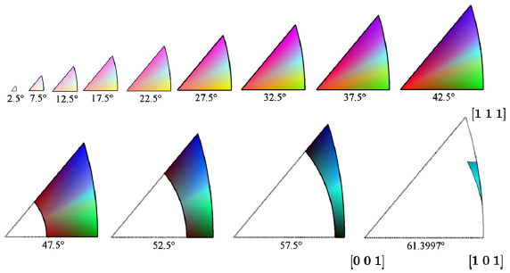

# Generate Misorientation Colors

## Group (Subgroup)

Processing (Crystallography)

## Description

This filter will generate colors based on the method developed by C. Schuh and S. Patala for cubic, hexagonal, tetragonal, or orthorhombic crystal structures (currently only the cubic high symmetry is working)[1]. Orientations are colored by _disorientation_ relative to a _reference orientation_. The user can enter a _Reference Orientation Axis_ and a _Reference Orientation Angle_ relative to the sample reference frame. The default reference orientation is the sample frame (misorientation from sample frame: 0o about [001]). The filter also has the option to apply a black color to all "bad" elements, as defined by a boolean _mask_ array, which can be generated using the Multi-Threshold Objects Filter.

### Important Implementation Notes

The user should be aware of the crystal symmetry (Laue Group and Point Group) of their data. The filter is only valid for certain point groups within a Laue group (See table below).

### Color Output Notes

With other coloring methods, such as IPF, "bad" elements which result from non-indexed EBSD scans can be colored with a black color. Since the misorientation coloring scheme uses all possible colors, marking voxels in an image in such a way that the voxels stand out is not possible.

### Crystal Symmetry Implementations

|Crystal Symmetry (Laue) | Hermann   Mauguin  Symbol | Schoenflies Symbol | Laue Class | Implemented  (Legend) |
|------------------------|-------------------------|-------------------| -----------|-----------------------|
| Triclinic | 1, -1  |  C1, C1 | -1 | Not Implemented|
| Monoclinic | 2, m, 2/m | C2, Cs, C2h | 2/m | Not Implemented |
| Orthorhombic | 222,, 2/m 2/m 2/m | D2, D2h | mmm |  |
| Orthorhombic | mm2 | C2v | mmm | Not Implemented |
| Trigonal (Low)|3, -3 | C3, C3i | -3 | Not Implemented |
| Trigonal (High)  | 32, 3m, -32/m | D3, C3v, D3d | -3m | Not Implemented |
| Tetragonal (Low) | 4, -4, 4/m | C4, S4, C4h | 4/m | Not Implemented |
| Tetragonal (High) | 422,  4/m 2/m 2/m | D4, D4h | 4/mmm |  |
| Tetragonal (High) | 4mmm, -42m | C4v, D2d | 4/mmm | Not Implemented|
| Hexagonal (Low) | 6, -6, 6/m | C6, C3h, C6h | 6/m | Not Implemented |
| Hexagonal  (High)| 622, 6/m 2/m 2/m | D6, D6h | 6/mmm |  |
| Hexagonal  (High)| 6mm, -62m | C6v, D3h | 6/mmm | Not Implemented |
| Cubic (Low) | 23, 2/m-3 | T, Th | m-3 |  |
| Cubic (High) | 432, 4/m -3 2/m | O, Oh| m-3m |  |
| Cubic (High) | -43m | Td| m-3m | Not Implemented |

### Example Output Images

-----

![Small IN100 courtesy of [2] showing a generally random texture](Images/Small_IN100_Miso_90.png)

-----

![Interstitial Free (IF) Steel courtesy of [3]](Images/Miso_fw-ar-IF1-avtr12-corr.png)

-----

% Auto generated parameter table will be inserted here

## References

- 1: [S. Patala, J. Mason, C. Schuh, 2012. Improved representations of misorientation information for grain boundary science and engineering. Prog Mater Sci. 57, 1383-1425.](https://doi.org/10.1016/j.pmatsci.2012.04.002)

- 2: [M. Groeber, B.K. Haley, M.D. Uchic, D.M. Dimiduk, S. Ghosh, 3D reconstruction and characterization of polycrystalline microstructures using a FIB SEM system Data Sets. Materials Characterization 2006, 57:259-273](https://doi.org/10.1016/j.commatsci.2007.04.007).

- 3: [N. Allain-Bonasso, F. Wagner, S. Berbenni, D.P. Field, A study of the heterogeneity of plastic deformation in IF steel by EBSD, Materials Science and Engineering: A, Volume 548, 30 June 2012, Pages 56-63, ISSN 0921-5093](http://dx.doi.org/10.1016/j.msea.2012.03.068).

- 4: [http://reference.iucr.org/dictionary/Laue_classes](http://reference.iucr.org/dictionary/Laue_classes)

## Example Pipelines

## License & Copyright

Please see the description file distributed with this **Plugin**

## DREAM3D-NX Help

If you need help, need to file a bug report or want to request a new feature, please head over to the [DREAM3DNX-Issues](https://github.com/BlueQuartzSoftware/DREAM3DNX-Issues/discussions) GItHub site where the community of DREAM3D-NX users can help answer your questions.
