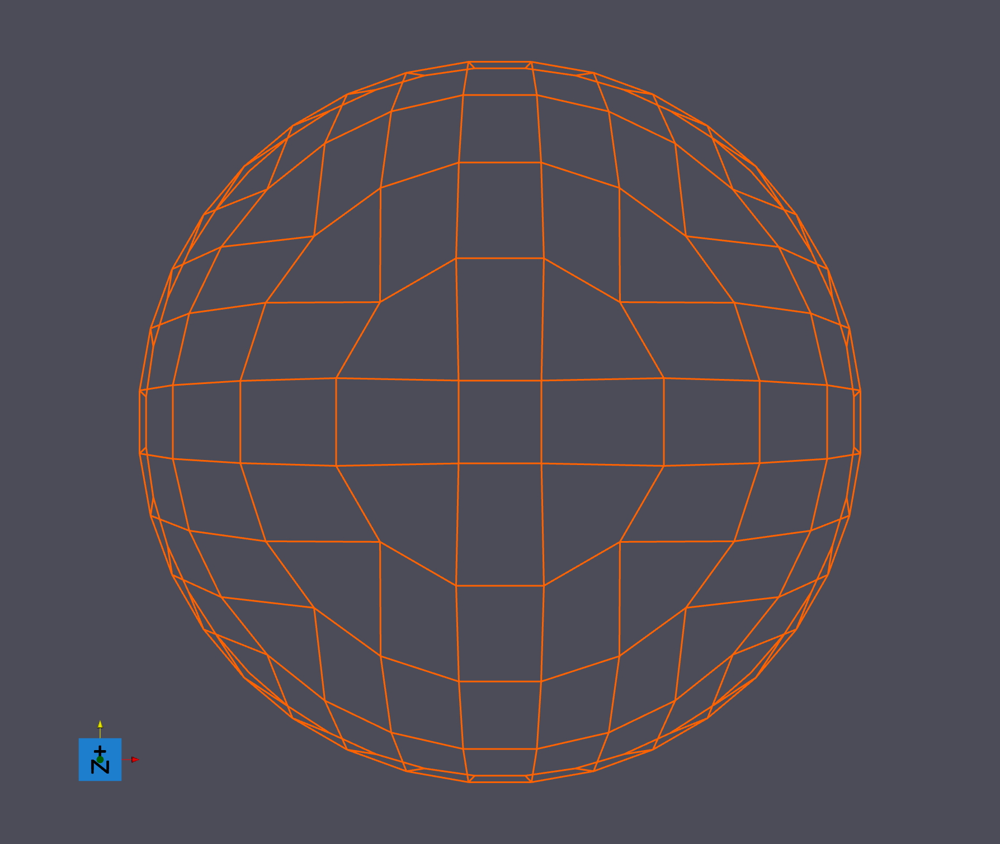
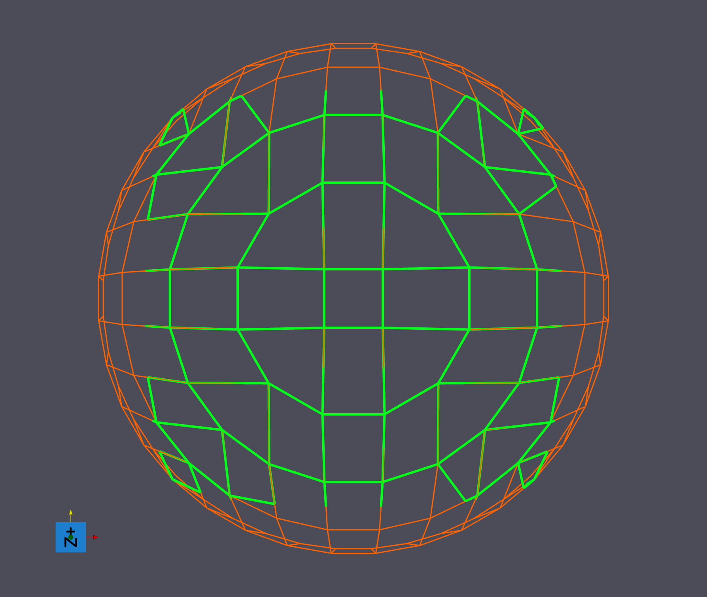

# Crop Geometry (Edge)

## Description

The **Crop Geometry (Edge) Filter** allows users to crop a region of interest (ROI) from an **Edge Geometry**. This filter is essential for isolating specific portions of edge-based data structures.

Users can selectively crop specific dimensions of the **Edge Geometry** by toggling **Crop X Dimension**, **Crop Y Dimension**, and **Crop Z Dimension** ON or OFF. Only dimensions that are turned ON will be cropped.

### Boundary Intersection Behavior

The filter provides options to handle edges that intersect the defined cropping bounds:

- **Filter Error**: Throws an error if any edge intersects the cropping boundary, ensuring strict adherence to the ROI.
- **Interpolate Outside Vertex**: Interpolates the position of vertices that lie outside the ROI, allowing partial edges to be included based on interpolation.
- **Ignore Edge**: Excludes edges that intersect the cropping boundary without throwing an error or interpolating vertices.

**NOTE:** When the **Interpolate Outside Vertex** boundary intersection behavior is chosen, this filter DOES NOT interpolate any vertex data, only the vertex position!

## Examples
In the following examples, an edge geometry with bounds (-1, 1), (-1, 1), (0, 1) is being used:

### Filter Error Example

| **Parameter**                      | **Value**             |
|------------------------------------|-----------------------|
| **Crop X Dimension**               | ON                    |
| **Crop Y Dimension**               | OFF                   |
| **Crop Z Dimension**               | OFF                   |
| **Min Coordinate**                 | (-1, 0, 0)            |
| **Max Coordinate**                 | (0.2, 0, 0)           |
| **Boundary Intersection Behavior** | Filter Error          |

Since **Crop X Dimension** is the only one turned on, only the X dimension will be cropped.  This means that the filter will only use the X min/max coordinate values to crop the edge geometry; the Y & Z min/max coordinate values will be ignored.

These inputs result in a filter execution error because an edge exists in the edge geometry with the following two vertices:

(0.071339, -0.997452, 0.0)  <--- Inside the X bounds of (-1, 0.2)
(0.212565, -0.977147, 0.0)  <--- Outside the X bounds of (-1, 0.2)

### Ignore Edges Example

| **Parameter**                      | **Value**             |
|------------------------------------|-----------------------|
| **Crop X Dimension**               | ON                    |
| **Crop Y Dimension**               | ON                    |
| **Crop Z Dimension**               | OFF                   |
| **Min Coordinate**                 | (-0.7, -0.7, 0)       |
| **Max Coordinate**                 | (0.7, 0.7, 0)         |
| **Boundary Intersection Behavior** | Ignore Edge           |

Since **Crop X Dimension** and **Crop Y Dimension** are turned on, only the X & Y dimensions will be cropped.  This means that the filter will only use the X & Y min/max coordinate values to crop the edge geometry; the Z min/max coordinate values will be ignored.

These inputs result in the following edge geometry output:

The original edge geometry is orange, the cropped edge geometry (which overlaps the orange) is in green.

As you can see, any edges that contain vertices that are outside (-0.7, 0.7) in the X dimension and (-0.7, 0.7) in the Y dimension have been cropped out.

### Interpolate Outside Vertices Example

| **Parameter**                      | **Value**                  |
|------------------------------------|----------------------------|
| **Crop X Dimension**               | ON                         |
| **Crop Y Dimension**               | ON                         |
| **Crop Z Dimension**               | OFF                        |
| **Min Coordinate**                 | (-0.7, -0.7, 0)            |
| **Max Coordinate**                 | (0.7, 0.7, 0)              |
| **Boundary Intersection Behavior** | Interpolate Outside Vertex |

Let's take the same example as the previous, but instead set the **Boundary Intersection Behavior** to interpolate outside vertices.

Again, since **Crop X Dimension** and **Crop Y Dimension** are turned on, only the X & Y dimensions will be cropped.  This means that the filter will only use the X & Y min/max coordinate values to crop the edge geometry; the Z min/max coordinate values will be ignored.

Unlike the last example, however, this time the filter will interpolate any outside vertices of edges that are intersecting the ROI boundary so that those edges can still be included in the final edge geometry:

The original edge geometry is orange, the cropped edge geometry (which overlaps the orange) is in green.

Three outside vertices, that have been interpolated to lie within the boundary, are circled in blue.

As you can see, the edges that intersect the ROI boundary have been interpolated so that the outside vertex lies exactly on the boundary edge.  Edges that have both vertices outside the boundary are cropped out completely.

% Auto generated parameter table will be inserted here

## Example Pipelines

## License & Copyright

Please see the description file distributed with this **Plugin**

## DREAM3D-NX Help

If you need help, need to file a bug report or want to request a new feature, please head over to the [DREAM3DNX-Issues](https://github.com/BlueQuartzSoftware/DREAM3DNX-Issues/discussions) GitHub site where the community of DREAM3D-NX users can help answer your questions.
